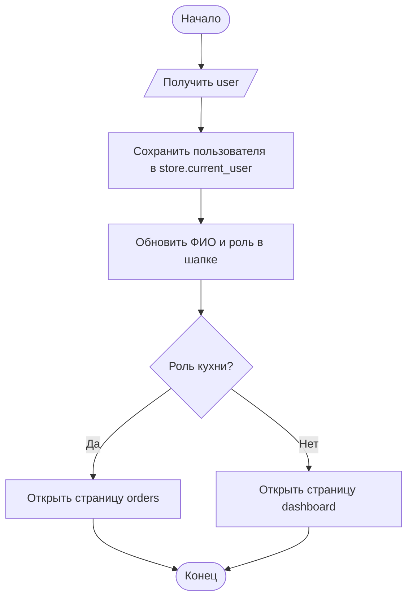
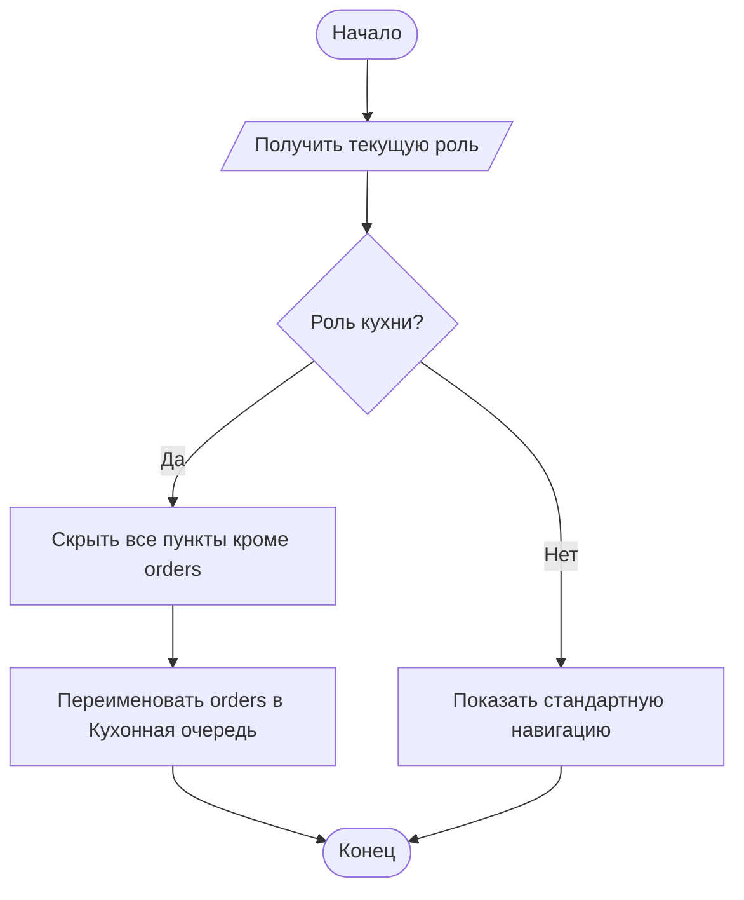
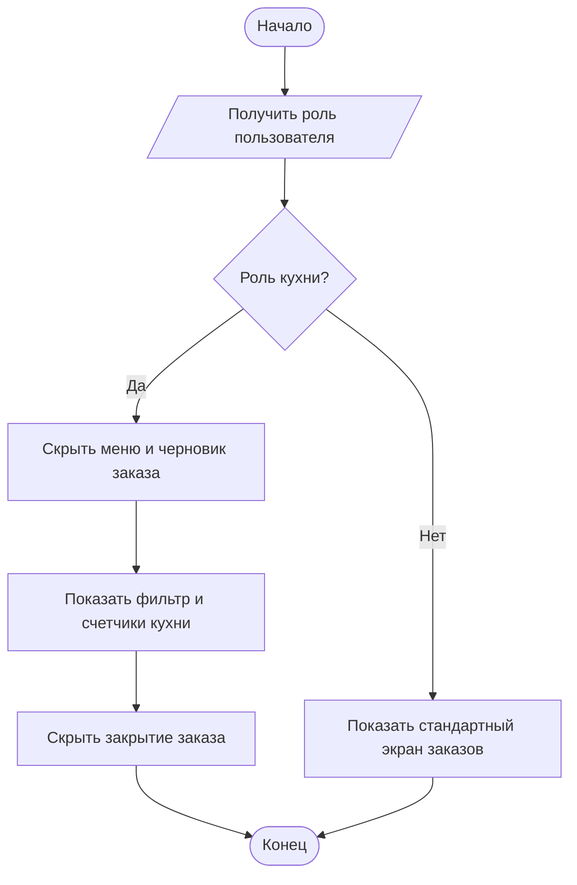
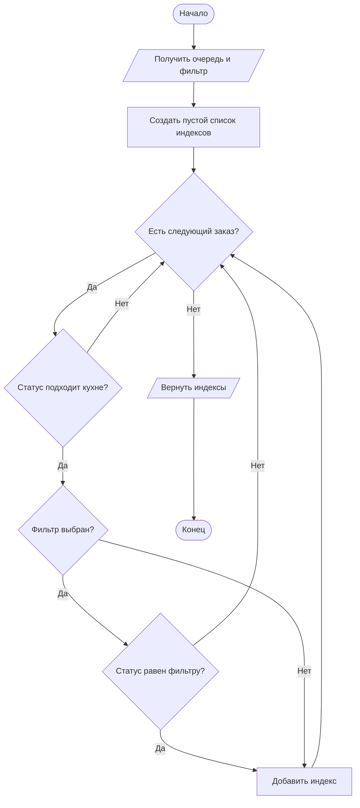
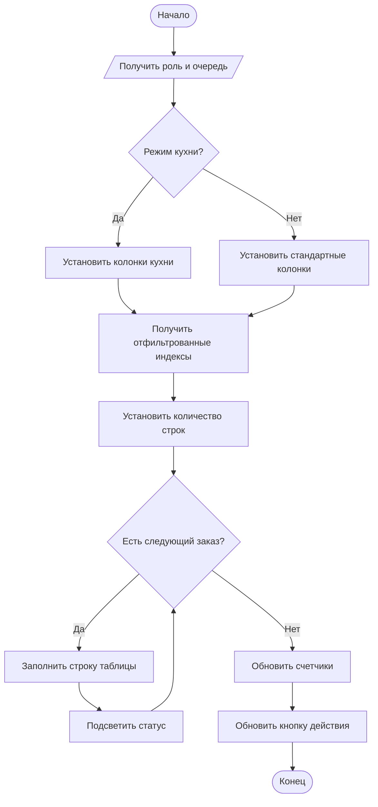
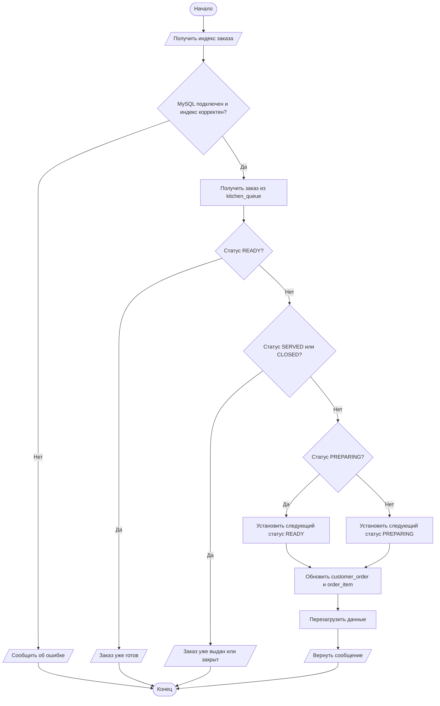

# Функции кухонного модуля GastroSoft

В этом документе описаны 6 функций кухонного модуля для курсовой работы. Блок-схемы представлены в текстовом формате Mermaid с обозначениями, соответствующими логике ГОСТ: овал - начало/конец, параллелограмм - ввод/вывод, прямоугольник - процесс, ромб - условие.

## 1. Авторизация и маршрутизация пользователя кухни

**Функция в коде:** `GastroSoftWindow.on_authenticated`

**Входные данные:** словарь `user` с ФИО, логином и ролью пользователя.

**Выходные данные:** установленный текущий пользователь, обновленная шапка интерфейса, открытая страница `orders` для кухни или `dashboard` для остальных ролей.

**Описание алгоритма:**

1. Получить объект пользователя после успешной авторизации.
2. Сохранить его в `store.current_user`.
3. Вывести ФИО и роль в шапке окна.
4. Проверить, относится ли роль к кухонным.
5. Если роль `Повар` или `Шеф-повар`, открыть кухонную очередь.
6. Иначе открыть главную панель.

**Алгоритм:**



**Работа функции и интеграция:** функция вызывается страницей авторизации после проверки логина и пароля. Она связывает модуль авторизации с оболочкой приложения и определяет, какой интерфейс увидит пользователь.

**Код:**

```python
def on_authenticated(self, user: dict) -> None:
    self.store.current_user = user
    self.user_name.setText(user["full_name"])
    self.user_role.setText(user["role"])
    self.show_status(f"Выполнен вход: {user['full_name']} ({user['role']})")
    self._apply_role_navigation()
    self.navigate("orders" if self._is_kitchen_user() else "dashboard")
```

## 2. Настройка навигации для кухонных ролей

**Функция в коде:** `GastroSoftWindow._apply_role_navigation`

**Входные данные:** текущий пользователь из `store.current_user`, набор кнопок навигации `nav_buttons`.

**Выходные данные:** для кухни видна только кнопка `Кухонная очередь`; для остальных ролей видны все стандартные страницы.

**Описание алгоритма:**

1. Определить, является ли текущий пользователь работником кухни.
2. Перебрать все кнопки боковой навигации.
3. Если пользователь относится к кухне, скрыть все кнопки кроме `orders`.
4. Переименовать кнопку `orders` в `Кухонная очередь`.
5. Если пользователь не относится к кухне, вернуть стандартные названия и видимость кнопок.

**Алгоритм:**



**Работа функции и интеграция:** функция вызывается после входа и выхода из системы. Она не меняет сами страницы, а управляет доступностью навигации в зависимости от роли.

**Код:**

```python
def _apply_role_navigation(self) -> None:
    is_kitchen = self._is_kitchen_user()
    for key, button in self.nav_buttons.items():
        button.setVisible(not is_kitchen or key == "orders")
        button.setText("Кухонная очередь" if is_kitchen and key == "orders" else self.nav_titles[key])
```

## 3. Включение кухонного режима страницы заказов

**Функция в коде:** `OrdersPage.apply_role_mode`

**Входные данные:** текущая роль пользователя и виджеты страницы заказов.

**Выходные данные:** скрытые блоки меню и черновика заказа для кухни; показанная панель фильтра и быстрых действий.

**Описание алгоритма:**

1. Проверить роль текущего пользователя.
2. Если это кухонная роль, скрыть карточки меню и текущего заказа.
3. Показать фильтр и счетчики кухонной очереди.
4. Скрыть кнопку закрытия заказа, так как кухня не отвечает за оплату и закрытие.
5. Если роль не кухонная, вернуть стандартный экран заказов.

**Алгоритм:**



**Работа функции и интеграция:** функция вызывается при обновлении страницы `OrdersPage`. Она позволяет использовать одну страницу для разных ролей, но показывать кухне только нужную часть интерфейса.

**Код:**

```python
def apply_role_mode(self) -> None:
    is_kitchen = self._is_kitchen_user()
    self.menu_card.setVisible(not is_kitchen)
    self.order_card.setVisible(not is_kitchen)
    self.kitchen_controls.setVisible(is_kitchen)
    self.close_order_button.setVisible(not is_kitchen)
    self.next_status_button.setText("Взять в работу" if is_kitchen else "Следующий статус")
```

## 4. Фильтрация заказов кухни

**Функция в коде:** `OrdersPage._filtered_queue_indices`

**Входные данные:** очередь заказов `store.kitchen_queue`, выбранный статус в `kitchen_filter`, роль пользователя.

**Выходные данные:** список индексов заказов, которые нужно показать в таблице.

**Описание алгоритма:**

1. Получить выбранный фильтр.
2. Создать пустой список индексов.
3. Перебрать заказы из общей очереди.
4. Для кухни исключить неактивные кухонные статусы.
5. Если выбран конкретный статус, оставить только заказы с этим статусом.
6. Вернуть список подходящих индексов.

**Алгоритм:**



**Работа функции и интеграция:** функция используется при заполнении таблицы кухни. Она отделяет данные от отображения: таблица получает уже отобранные индексы заказов.

**Код:**

```python
def _filtered_queue_indices(self) -> list[int]:
    selected_status = self.kitchen_filter.currentText()
    indices = []
    for index, item in enumerate(self.store.kitchen_queue):
        status = item["status"]
        if self._is_kitchen_user() and status not in KITCHEN_ACTIVE_STATUSES:
            continue
        if self._is_kitchen_user() and selected_status != "Все активные" and status != selected_status:
            continue
        indices.append(index)
    return indices
```

## 5. Формирование таблицы кухонной очереди

**Функция в коде:** `OrdersPage.populate_kitchen`

**Входные данные:** отфильтрованная очередь заказов, роль пользователя, данные заказа: номер, стол, время, состав, статус.

**Выходные данные:** заполненная таблица кухонной очереди и обновленные счетчики статусов.

**Описание алгоритма:**

1. Определить режим страницы: кухня или стандартный экран заказов.
2. Выбрать набор колонок таблицы.
3. Получить индексы заказов после фильтрации.
4. Установить количество строк таблицы.
5. Для каждого заказа заполнить ячейки.
6. Подсветить ячейку статуса.
7. Выбрать первую строку при наличии заказов.
8. Обновить счетчики и доступность кнопки действия.

**Алгоритм:**



**Работа функции и интеграция:** функция отвечает за визуальное представление очереди. Она использует данные из хранилища, фильтр статусов и вспомогательные функции подсветки таблицы.

**Код:**

```python
def populate_kitchen(self) -> None:
    is_kitchen = self._is_kitchen_user()
    headers = (
        ["Номер", "Стол", "Время", "Состав заказа", "Статус"]
        if is_kitchen
        else ["Номер", "Стол", "Состав", "Статус"]
    )
    self.kitchen_table.setColumnCount(len(headers))
    self.kitchen_table.setHorizontalHeaderLabels(headers)
    self.visible_queue_indices = self._filtered_queue_indices()
    self.kitchen_table.setRowCount(len(self.visible_queue_indices))
    # Далее строки таблицы заполняются данными заказов и подсвечиваются по статусу.
    self.update_kitchen_summary()
    self.update_kitchen_actions()
```

## 6. Перевод заказа на следующий кухонный статус

**Функция в коде:** `MySQLBackedStore.advance_kitchen_order`

**Входные данные:** индекс выбранного заказа в `kitchen_queue`.

**Выходные данные:** сообщение о результате операции, обновленный статус заказа в MySQL и обновленная очередь заказов.

**Описание алгоритма:**

1. Проверить подключение MySQL и корректность индекса.
2. Получить выбранный заказ.
3. Определить текущий статус заказа.
4. Если заказ уже готов, не менять статус.
5. Если заказ выдан или закрыт, не менять статус.
6. Если заказ принят, перевести его в `Готовится`.
7. Если заказ готовится, перевести его в `Готов`.
8. Обновить статус заказа и позиций в базе данных.
9. Перезагрузить данные из MySQL.

**Алгоритм:**



**Работа функции и интеграция:** функция вызывается кнопкой на кухонной странице. Она работает не только с интерфейсом, но и с базой данных: меняет статус заказа в `customer_order`, статусы блюд в `order_item`, после чего обновляет данные приложения.

**Код:**

```python
def advance_kitchen_order(self, index: int) -> str:
    if not self.mysql_enabled or index < 0 or index >= len(self.kitchen_queue):
        return "MySQL не подключен или заказ не выбран."

    order = self.kitchen_queue[index]
    current_code = ORDER_STATUS_TO_CODE.get(order["status"], "ACCEPTED")
    if current_code == "READY":
        return "Заказ уже отмечен как готовый."
    if current_code in {"SERVED", "CLOSED"}:
        return "Заказ уже выдан или закрыт."

    next_code = "READY" if current_code == "PREPARING" else "PREPARING"
    return self._set_order_status(order, next_code)
```
