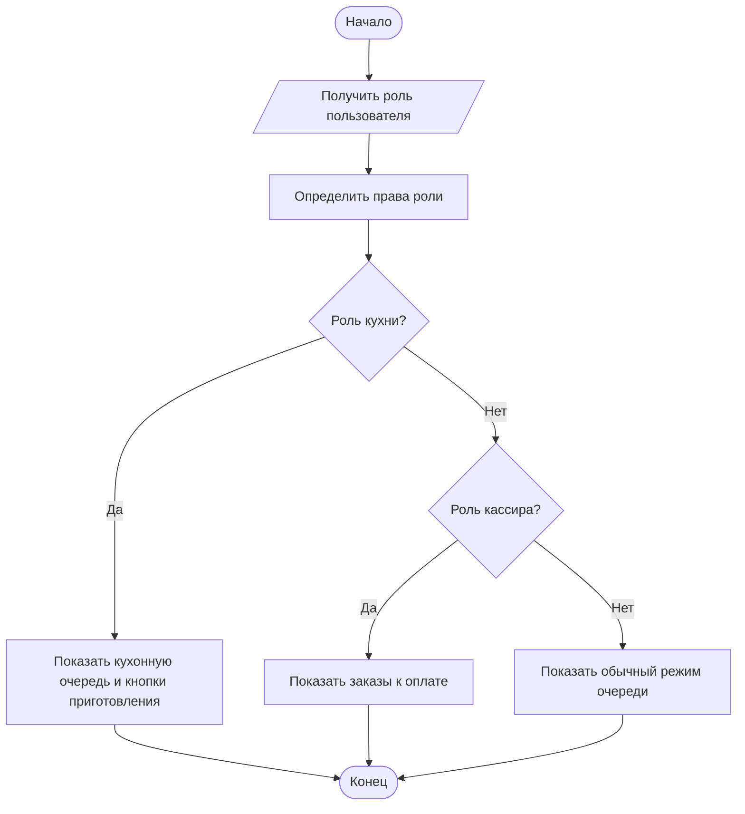
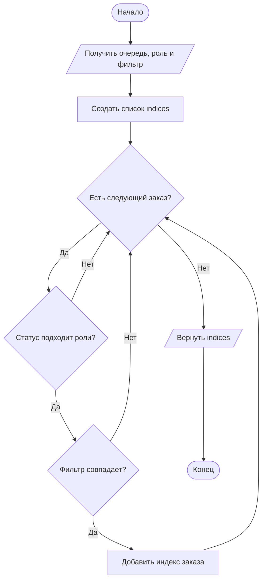
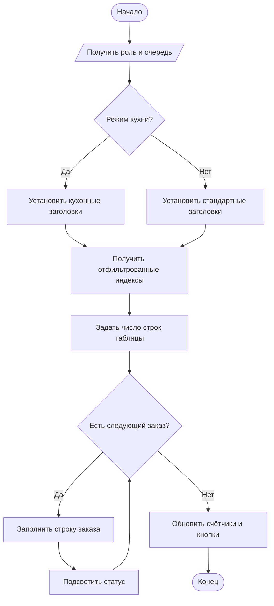
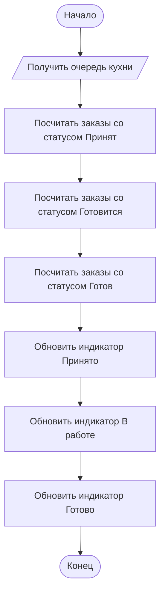
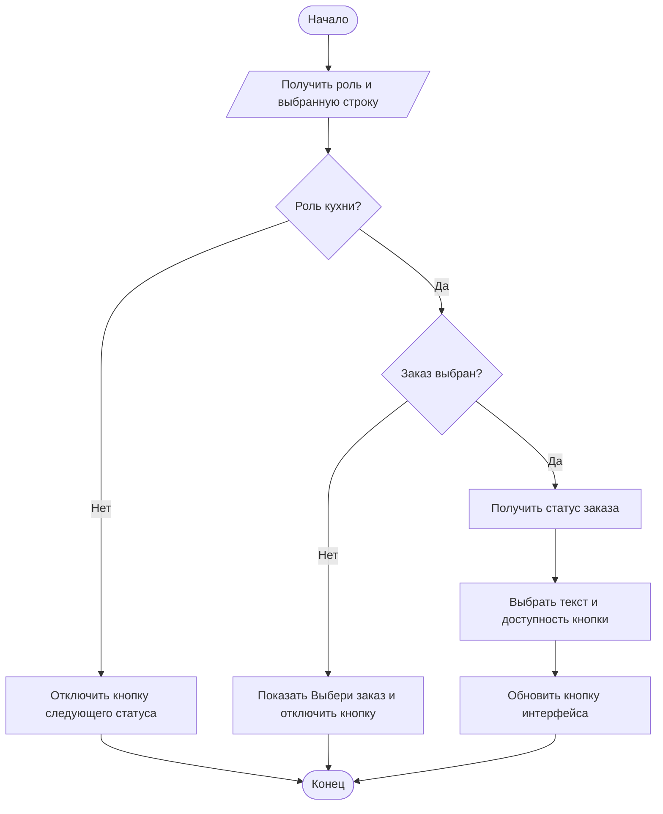
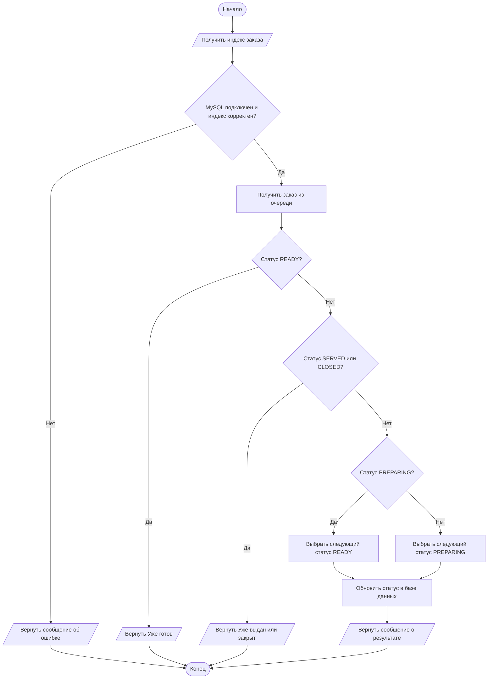

# Функции кухонного модуля GastroSoft

В документе описаны 6 функций кухонного сценария. Остальные модули приложения не изменяются; функции из слоя хранения указаны только там, где они непосредственно участвуют в работе кухни.

В блок-схемах используются обозначения по ГОСТ 19.701-90: овал - начало и конец, параллелограмм - ввод/вывод, прямоугольник - процесс, ромб - условие.

## 1. Включение кухонного режима страницы заказов

**Функция в коде:** `OrdersPage.apply_role_mode`

**Входные данные:** текущая роль пользователя, права роли, виджеты страницы заказов.

**Выходные данные:** настроенная видимость блоков меню, текущего заказа, кухонной очереди и кнопок действий.

**Описание алгоритма:**

1. Получить текущую роль пользователя.
2. Определить, может ли роль оформлять заказы, работать с кухней или закрывать заказы.
3. Рассчитать, нужно ли показывать список заказов.
4. Настроить видимость карточек меню, черновика заказа и кухонной очереди.
5. Если роль относится к кухне, установить заголовок «Кухонная очередь» и начальный текст кнопки «Взять в работу».
6. Если роль относится к кассе, показать экран заказов к оплате; иначе оставить режим просмотра очереди.

**Алгоритм:**



**Работа функции и интерфейс:** Функция вызывается при обновлении страницы заказов и адаптирует один экран под разные роли. Для повара и шеф-повара остаётся только рабочая область кухни: таблица заказов, фильтр, счётчики и кнопка изменения статуса. Остальные элементы оформления заказа скрываются, поэтому пользователь не видит лишних сценариев.

**Код:**

```python
def apply_role_mode(self) -> None:
    role = self._current_role()
    can_create = can_create_orders(role)
    is_kitchen = can_process_kitchen(role)
    can_close = can_close_orders(role)
    show_order_list = is_kitchen or can_close

    self.menu_card.setVisible(can_create)
    self.order_card.setVisible(can_create)
    self.kitchen_card.setVisible(show_order_list)
    self.kitchen_controls.setVisible(is_kitchen)
    self.next_status_button.setVisible(is_kitchen)
    self.close_order_button.setVisible(can_close)

    if is_kitchen:
        self.kitchen_card.set_header("Кухонная очередь", "Повар и шеф-повар меняют только статусы приготовления.")
        self.next_status_button.setText("Взять в работу")
    elif can_close:
        self.kitchen_card.set_header("Заказы к оплате", "Кассир закрывает готовые и выданные заказы.")
    else:
        self.kitchen_card.set_header("Очередь заказов", "Просмотр заказов текущей смены.")
```

## 2. Фильтрация заказов кухонной очереди

**Функция в коде:** `OrdersPage._filtered_queue_indices`

**Входные данные:** общая очередь `store.kitchen_queue`, выбранный фильтр статуса и роль пользователя.

**Выходные данные:** список индексов заказов, которые должны отображаться в таблице.

**Описание алгоритма:**

1. Получить выбранное значение фильтра статуса.
2. Создать пустой список индексов.
3. Последовательно перебрать все заказы из кухонной очереди.
4. Для кухонной роли исключить заказы, статус которых не входит в активные кухонные статусы.
5. Если выбран конкретный фильтр, оставить только заказы с совпадающим статусом.
6. Для кассира оставить только заказы в статусах, доступных к выдаче или закрытию.
7. Добавить подходящий индекс в результирующий список и вернуть его.

**Алгоритм:**



**Работа функции и интерфейс:** Функция связывает выпадающий список фильтра с таблицей заказов. Когда пользователь выбирает «Все активные», «Принят», «Готовится» или «Готов», таблица получает не копии заказов, а индексы нужных записей. Это позволяет сохранить связь между выбранной строкой интерфейса и исходным заказом в хранилище.

**Код:**

```python
def _filtered_queue_indices(self) -> list[int]:
    selected_status = self.kitchen_filter.currentText()
    indices = []
    role = self._current_role()
    for index, item in enumerate(self.store.kitchen_queue):
        status = item["status"]
        if can_process_kitchen(role) and status not in KITCHEN_ACTIVE_STATUSES:
            continue
        if can_process_kitchen(role) and selected_status != "Все активные" and status != selected_status:
            continue
        if role == "Кассир" and status not in CASHIER_VISIBLE_STATUSES:
            continue
        indices.append(index)
    return indices
```

## 3. Формирование таблицы кухонной очереди

**Функция в коде:** `OrdersPage.populate_kitchen`

**Входные данные:** очередь заказов, роль пользователя, отфильтрованные индексы, данные заказа: номер, стол, время, состав и статус.

**Выходные данные:** заполненная таблица кухонной очереди, выделенная первая строка, обновлённые счётчики и состояние кнопок.

**Описание алгоритма:**

1. Определить роль пользователя и режим отображения страницы.
2. Выбрать набор заголовков таблицы для кухни или общего режима.
3. Получить список индексов заказов после фильтрации.
4. Установить количество строк таблицы по числу видимых заказов.
5. Для каждого видимого заказа заполнить ячейки номером, столом, временем, составом и статусом.
6. Для ячейки статуса выбрать цветовое состояние: предупреждение, информация, успех или нейтральный тон.
7. Если список не пустой, выделить первую строку.
8. Обновить сводные счётчики и доступность кнопки действия.

**Алгоритм:**



**Работа функции и интерфейс:** Функция отвечает за основное представление кухни: именно она превращает данные из очереди в строки таблицы. Повар видит читаемый список активных заказов с временем и составом, а цвет статуса помогает быстро отличать новые, готовящиеся и готовые заказы.

**Код:**

```python
def populate_kitchen(self) -> None:
    role = self._current_role()
    is_kitchen = can_process_kitchen(role)
    headers = (
        ["Номер", "Стол", "Время", "Состав заказа", "Статус"]
        if is_kitchen
        else ["Номер", "Стол", "Время", "Состав", "Статус"]
    )
    self.kitchen_table.setColumnCount(len(headers))
    self.kitchen_table.setHorizontalHeaderLabels(headers)
    self.kitchen_table.verticalHeader().setDefaultSectionSize(58 if is_kitchen else 34)

    self.visible_queue_indices = self._filtered_queue_indices()
    self.kitchen_table.setRowCount(len(self.visible_queue_indices))
    for row_index, queue_index in enumerate(self.visible_queue_indices):
        queue_item = self.store.kitchen_queue[queue_index]
        values = (
            [
                queue_item["order_no"],
                queue_item["table"],
                queue_item.get("created", "-"),
                queue_item["items"],
                queue_item["status"],
            ]
            if is_kitchen
            else [
                queue_item["order_no"],
                queue_item["table"],
                queue_item.get("created", "-"),
                queue_item["items"],
                queue_item["status"],
            ]
        )
        for column_index, value in enumerate(values):
            item = QTableWidgetItem(str(value))
            item.setFlags(item.flags() & ~Qt.ItemFlag.ItemIsEditable)
            item.setToolTip(str(value))
            if column_index == len(headers) - 1:
                tone = "warning"
                if value == "Готов":
                    tone = "success"
                elif value == "Выдан":
                    tone = "muted"
                elif value == "Готовится":
                    tone = "info"
                tint_table_item(item, tone)
            self.kitchen_table.setItem(row_index, column_index, item)
    if self.visible_queue_indices:
        self.kitchen_table.selectRow(0)

    self.update_kitchen_summary()
    self.update_kitchen_actions()
```

## 4. Расчёт сводных счётчиков кухни

**Функция в коде:** `OrdersPage.update_kitchen_summary`

**Входные данные:** очередь заказов `store.kitchen_queue` и набор активных кухонных статусов.

**Выходные данные:** обновлённые индикаторы количества заказов в состояниях «Принят», «Готовится» и «Готов».

**Описание алгоритма:**

1. Создать словарь количества заказов по активным кухонным статусам.
2. Для каждого статуса посчитать записи очереди, у которых статус совпадает.
3. Передать количество новых заказов в индикатор «Принято».
4. Передать количество заказов в работе в индикатор «В работе».
5. Передать количество готовых заказов в индикатор «Готово».

**Алгоритм:**



**Работа функции и интерфейс:** Функция обновляет небольшие статусные метки над таблицей. Они дают повару и шеф-повару быстрый обзор загрузки кухни без чтения каждой строки: сколько заказов только поступило, сколько уже готовится и сколько ожидает выдачи.

**Код:**

```python
def update_kitchen_summary(self) -> None:
    counts = {
        status: len([item for item in self.store.kitchen_queue if item["status"] == status])
        for status in KITCHEN_ACTIVE_STATUSES
    }
    self.summary_pills["accepted"].set_state(f"Принято: {counts['Принят']}", "warning")
    self.summary_pills["preparing"].set_state(f"В работе: {counts['Готовится']}", "info")
    self.summary_pills["ready"].set_state(f"Готово: {counts['Готов']}", "success")
```

## 5. Обновление кнопки действия для выбранного заказа

**Функция в коде:** `OrdersPage.update_kitchen_actions`

**Входные данные:** текущая роль пользователя, выбранная строка таблицы и статус выбранного заказа.

**Выходные данные:** текст и доступность кнопки перехода заказа на следующий этап.

**Описание алгоритма:**

1. Получить роль пользователя.
2. Если роль не может работать с кухней, отключить кнопку следующего статуса и завершить выполнение.
3. Определить индекс выбранного заказа.
4. Если заказ не выбран, вывести текст «Выбери заказ» и отключить кнопку.
5. Получить текущий статус выбранного заказа.
6. По статусу выбрать текст кнопки и признак доступности действия.
7. Применить выбранный текст и состояние кнопки в интерфейсе.

**Алгоритм:**



**Работа функции и интерфейс:** Функция вызывается при выборе строки в таблице. Она не меняет данные заказа, а подготавливает безопасное действие: для статуса «Принят» предлагает взять заказ в работу, для «Готовится» - отметить готовым, а для «Готов» блокирует повторное выполнение.

**Код:**

```python
def update_kitchen_actions(self) -> None:
    role = self._current_role()
    if not can_process_kitchen(role):
        self.next_status_button.setEnabled(False)
        self.close_order_button.setEnabled(self._selected_queue_index() >= 0 and can_close_orders(role))
        return

    queue_index = self._selected_queue_index()
    if queue_index < 0:
        self.next_status_button.setText("Выбери заказ")
        self.next_status_button.setEnabled(False)
        return

    status = self.store.kitchen_queue[queue_index]["status"]
    next_actions = {
        "Принят": ("Взять в работу", True),
        "Готовится": ("Отметить готовым", True),
        "Готов": ("Заказ готов", False),
        "Выдан": ("Уже выдан", False),
    }
    text, enabled = next_actions.get(status, ("Следующий этап", True))
    self.next_status_button.setText(text)
    self.next_status_button.setEnabled(enabled)
```

## 6. Перевод заказа на следующий кухонный статус

**Функция в коде:** `MySQLBackedStore.advance_kitchen_order`

**Входные данные:** индекс выбранного заказа в очереди `kitchen_queue`.

**Выходные данные:** текстовое сообщение о результате, обновлённый статус заказа и позиций заказа в базе данных.

**Описание алгоритма:**

1. Проверить, подключена ли MySQL-база и корректен ли индекс заказа.
2. Получить выбранный заказ из очереди.
3. Определить код текущего статуса заказа.
4. Если заказ уже готов, вернуть сообщение без изменения данных.
5. Если заказ выдан или закрыт, вернуть сообщение без изменения данных.
6. Если заказ готовится, выбрать следующий статус READY; иначе выбрать PREPARING.
7. Передать заказ и новый статус во внутреннюю функцию обновления статуса.
8. Вернуть сообщение о результате операции.

**Алгоритм:**



**Работа функции и интерфейс:** Функция относится к слою хранения данных, но используется в кухонном сценарии через кнопку на странице заказов. После выбора строки повар нажимает кнопку действия, интерфейс передаёт индекс заказа в хранилище, а хранилище меняет статус в таблицах MySQL и возвращает сообщение для строки состояния приложения.

**Код:**

```python
def advance_kitchen_order(self, index: int) -> str:
    if not self.mysql_enabled or index < 0 or index >= len(self.kitchen_queue):
        return "MySQL не подключен или заказ не выбран."

    order = self.kitchen_queue[index]
    current_code = ORDER_STATUS_TO_CODE.get(order["status"], "ACCEPTED")
    if current_code == "READY":
        return "Заказ уже отмечен как готовый."
    if current_code in {"SERVED", "CLOSED"}:
        return "Заказ уже выдан или закрыт."

    next_code = "READY" if current_code == "PREPARING" else "PREPARING"
    return self._set_order_status(order, next_code)
```
